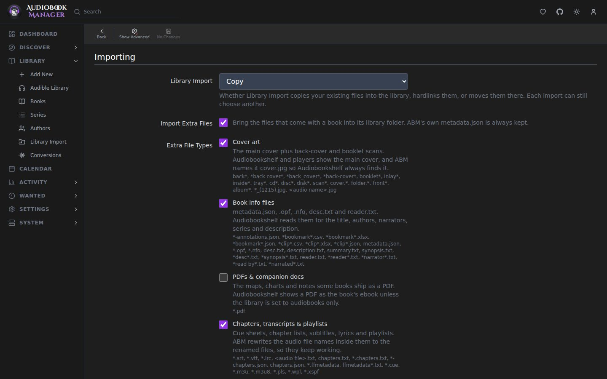

**Settings > Media Management** controls where books live and how files move in. Settings marked advanced appear with **Show Advanced**.

## Root Folders

A root folder is a directory ABM manages books in. Add one with **Add Root Folder**, which opens a folder browser with a typeable path. ABM can also list unmapped folders under a root and import them. A root's free space and hardlink support are checked when it is added. Removing a root asks what to do: **Remove from ABM only** (the default) forgets the books under it and leaves the files, and **Delete the books and their files** permanently deletes everything under the path without using the recycling bin. A root with books in it makes you type to confirm. Removing a root also deletes any auto-tag rule condition that named it.

Adding a root folder that is, contains or sits inside the [recycle bin](#recycle-bin) is refused with HTTP 400, naming the bin. Root folders can't be nested. Adding one that sits inside another root, or that contains one, is refused with HTTP 400 naming the other root. If you already have a nested pair, System > Status warns and names both paths. A book counts under, and is removed with, the most specific root that holds it, so removing the outer root leaves the inner root's books alone, and **Delete the books and their files** is refused while another root lies inside the one you're removing.

The default root folder is the one new books go to and the one that decides whether hardlink is offered for Library Import.

## Folders

| Setting | Default | Effect |
|---|---|---|
| Create Empty Book Folders | off | Creates missing book folders on add, on root folder change and during a disk scan. Ignored while **Delete empty folders** is on, so a folder is not made only to be removed. |
| Delete empty folders | off | Deletes empty book folders during a disk scan and when book files are deleted |

## Importing

| Setting | Default | Effect |
|---|---|---|
| Skip Free Space Check | off | For when ABM cannot detect free space on a root |
| Minimum Free Space | 100 (MB) | An import that would leave less than this is refused |
| Use Hardlinks instead of Copy | on | For completed downloads: hardlink instead of copy, so seeding does not double the space. Needs the same volume. |
| Library Import | Copy | The default for [Library Import](/library-import/): copy, hardlink or move. Hardlink is grayed out until the default root has been checked and supports it. |
| Import Extra Files | on | Whether non-audio files come along at all. Applies to Library Import, Manual Import and completed downloads |
| Extra File Extensions (advanced) | empty | More file types to bring along, kept under their own names, for example `srt, lrc`. With or without the dot, separated by commas or spaces. Blocked types, such as executables and partial downloads, can't be saved. Disabled while **Import Extra Files** is off |
| Preferred Cover (advanced) | Matched | Matched edition's cover, or the folder's best image, when both exist |

**Import Extra Files** brings a book's other files along with its audio. Five options pick which kinds come along, and a file matching **Extra File Extensions** comes along even when its kind is off:

| Option | Default | Covers |
|---|---|---|
| Cover art | on | Cover plus back-cover and booklet scans |
| Book info files | on | metadata.json, .opf, desc.txt, reader.txt. A release .nfo stays behind unless you choose it |
| PDFs & companion docs | off | PDFs shipped with a book |
| Chapters, transcripts & playlists | on | .cue, chapter lists, subtitles, lyrics, playlists. File names inside them are rewritten to the renamed audio. |
| Audible originals & ebooks | off | .aax/.aaxc, vouchers, epub and similar |

Partial downloads and executables are never imported. ABM's own `metadata.json` is always handled by ABM.

Hardlink is not the same as **Use Hardlinks instead of Copy**. That one is for downloads. The Library Import default is only what the Add to Library dialog preselects.

## File Management

| Setting | Default | Effect |
|---|---|---|
| Unmonitor Deleted Books | off | A book deleted from disk is unmonitored |
| Change File Date | None | Changes file dates on import and rescan |
| Enable Recycle Bin | on | Deleted book files, and the originals a conversion replaces, move to one bin instead of being deleted. Off means both are deleted for good |
| Recycle Bin | empty | Where the bin is. Empty uses `/config/recycle`, with a `media` folder for deleted book files and a `conversions` folder for replaced conversion originals |
| Recycle Bin Cleanup | 7 (days) | How long items stay, for both folders. 0 disables automatic cleanup |
| Library Scan Interval | 24 (hours) | Hours between automatic scans. Choices are Disabled, every hour, 6, 12 or 24 hours, or weekly |
| Watch for Changes | on | Scan when files are added, removed or changed. A root folder the system can't watch, such as one past the inotify watch limit, is logged and skipped instead of stopping startup |
| Cover Cache Workers | 4 | How many covers are downloaded at once when caching artwork, from 1 to 16 |

A scan or refresh treats file extensions in any case (`Chapter 1.MP3`) and files at any depth (`Disc 1/`, `Disc 2/`) as the book's audio. A book is left alone when its files can't be read, or when its tracked files still exist somewhere other than the folder searched: nothing is changed, a single-book refresh says "Some files could not be read; book left untouched.", and a library scan counts the book as skipped. A scan also skips a book whose folder is busy with a file transfer or another scan, with the reason "its folder is busy with a file transfer or another scan". That is routine, especially for a Watch for Changes scan during an import, and the next scan picks the book up.

A book, author or series refresh, and the book refresh endpoint, also leave a book alone while its files are being imported or scanned. The book is reported as skipped with "A file transfer or scan is in progress; book left untouched." The book refresh endpoint answers `success=false` with that message. In author and series results it counts as a skipped book with error type `import_pending`, not as updated. A root folder that doesn't answer within 10 seconds is treated as unusable instead of being waited on. A scan also leaves a book alone while an import is bringing its files in, and counts it as skipped. An import that finds a scan already reading its book waits for it to finish. Audible downloads land in the library under a temporary name, so a scan never sees a half-copied file.

## Recycle Bin

There is one recycle bin, set here. Inside it, `media/` holds deleted book files and `conversions/` holds the originals a conversion replaced when **Delete Original** is on. The one setting and the one retention above cover both. The Conversions page has no bin settings of its own, and the bin is never emptied by size, only by age.

Keep the bin outside every root folder. A bin that is a root folder, sits inside one, or contains one is refused, and so is a protected folder. The refusal shows under the folder field the moment you pick or type the path, with the server's reason, so you find out before you press Save. System > Status still warns about a bin that already sits inside a root.

Picking a new folder, in the folder browser or by typing a path, asks right away what to do with what is in the old bin: **Move them to the new folder**, **Leave them where they are** (they stop being cleaned up automatically), or **Delete them**, which makes you type `delete` to confirm. Move and delete also refuse a new folder nested inside the current bin. Nothing moves on disk until you press Save. A move and a delete then run as the tasks **Move Recycle Bin** and **Empty Old Recycle Bin** on System > Tasks. A move switches the bin only once the old one is empty, so one that fails partway keeps the old bin and can be run again. Only one of them runs at a time. If either task cannot be queued, the change is refused with "Could not queue the task.". If an old bin holds a root folder, its files can only be left in place.

## Quality Upgrades

| Setting | Default | Effect |
|---|---|---|
| Automatic Upgrade Search | on | Periodically searches for better releases of downloaded books still below their cutoff. A copy replaces yours only when it is a real upgrade. |
| Upgrade Search Interval | 24 (hours) | How often it runs |

## Permissions (advanced)

| Setting | Default | Effect |
|---|---|---|
| Set Permissions | off | Run chmod on import and rename |
| chmod Folder | 755 | Octal mode for folders and files, without execute bits for files |
| chown Group | empty | Group name or gid. Use a gid on remote file systems |

## Gotchas

- If the recycle bin is enabled but its folder is unavailable, deletes that need it fail instead of deleting permanently.
- Hardlinks only work inside one filesystem. Files that cannot be linked are copied, never moved, and counted in the import result.

## File names

Rename Files, Library Import, Manual Import, Audible downloads and conversions all build a book's file name in one place, so they agree: `Title - (Part 01) - (2020) - (MP3).mp3`. A one-file book has no part. A multi-file book gets `Part 01`, `Part 02` and so on in listening order, padded to the width of the file count, and the extension is lowercase. A rename where files trade names, or shift by one, goes through without losing any. A multi-part book imported under an older layout, or with an upper-case extension, shows as needing a rename the next time Rename runs.

Names are cut to fit the 255-byte filename limit. The title is shortened, never the part number or the extension, and split chapter files, sidecars named after the audio and a folder's ` [ASIN]` tag get the same treatment.

## Book Naming

Book Naming sets how I name files and folders, and it is saved with the page's one Save along with the rest of Media Management. It has Rename Books, Replace Illegal Characters, Colon Replacement (with a custom option), and formats for Standard Book, Author Folder, Series Folder, Standalone Folder and Book Folder. Each format shows a live example, and a token list shows every token you can use.

Library, Series and Authors also have an **Organize** action on the selected books, and so does a book's own page. It opens a preview of every change first, and nothing moves until you confirm it. Organize then moves and renames: it moves each book's folder to where the naming settings put it and renames its files. It runs as a task you can follow, cancel and, after a restart, resume where it stopped. Only one Organize runs at a time. There is no undo, so check the preview. Bulk rename stays on Library, Series and Authors as **Rename Files**.

If an Organize is interrupted, the next run resumes where it stopped. A book the interrupted run had already moved or renamed on disk is found at its new location and its records are updated, so nothing is moved twice. The preview shows such a book as already moved or already renamed, and the result counts it as reconciled. A book is only reconciled when I can prove the folder is that book's: its files must match what I have recorded and no other book may claim the folder. Otherwise the book is skipped, with the reason. A book whose pending renames swap two files of the same size, or of an unrecorded size, is skipped too, because the files could not be told apart if a run stopped halfway. There is still no undo.

A file or folder is skipped when something else already has its new name, and a broken symlink at that name counts as something. A rename that only changes letter case, such as `book.mp3` to `Book.mp3`, goes through on a drive that ignores case, like an SMB share or a Windows or macOS folder, because the only thing there is the book's own file or folder. The same goes for moving a book's folder from its edit dialog.

The preview lists only the books that would change. Tick **Show all selected books** to see the rest too. It loads in pages, so use **Load more** to keep going through a big selection. The preview's title counts how many books will change and how many will be skipped.

On a book's page, a book whose folder isn't where the naming settings would put it says so, shows the folder it would go to, and has an Organize button.

When a book's new folder would sit inside the folder it is in now, Organize makes the subfolder there and moves only that book's own files into it: its audio, plus the cover, chapter and other sidecar files I keep for it. Anything else in the folder stays where it was. The preview says "Moves into a subfolder" and lists what stays, and the result dialog lists the files left where they were. If a move fails partway, the files already moved are put back. Moving a book's folder from its edit dialog into a subfolder of itself works the same way.

Library Import follows the same naming settings, including when it adds a book that already sits in a root folder or moves files into a book I already have. With Rename Books off, each file keeps the name it came with. A file whose name would clash with another file in the batch, or with one already in the book's folder (case ignored), takes the name from the format instead, and the import notes which files it did that for. With Rename Books on, files that would get the same name are numbered by position, so Manual Import never skips one.

The default layout is `Author/Series/Vol 01 - 2004 - Title [ASIN]/Title - (2004) - (MP3).mp3`. A standalone book has no series folder or volume: `Author/2004 - Title [ASIN]/Title - (2004) - (MP3).mp3`. A series book with no position also starts with the year. A year that isn't known is left out, never written as `(Unknown)`.

If you know Sonarr: this is Sonarr's Media Management, naming formats included.
